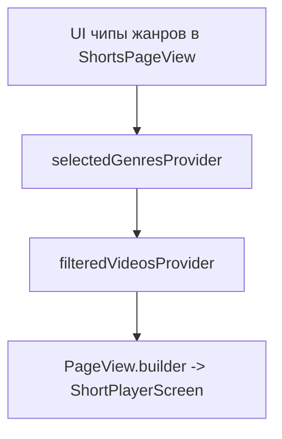

## Цель

Сделать фильтрацию жанров в ленте (`ShortsPageView`) мультивыбором: пользователь может выбрать несколько жанров одновременно; лента показывает видео, у которых есть хотя бы один выбранный жанр (OR). Пункт "All" ведет себя как переключатель-очистка: при выборе "All" очищаем набор выбранных жанров и показываем все.

## План реализации

### 1) Состояние выбранных жанров

- В `lib/providers.dart` заменить одиночный фильтр `selectedGenreProvider` (строка) на мультивыбор:
  - создать `selectedGenresProvider` как `StateProvider<Set<String>>` (или `StateProvider<List<String>>`, но Set удобнее для contains/toggle).
  - оставить `availableGenresProvider` как источник списка жанров (там уже есть добавление `'All'` первым).
- Обновить `filteredVideosProvider`:
  - если `selectedGenres` пустой => вернуть `allVideos`
  - иначе => `allVideos.where((v) => v.genres.any(selectedGenres.contains)).toList()`

### 2) UI в ленте (ShortsPageView)

- В `lib/screens/shorts_page_view.dart` заменить логику с `selectedGenreProvider`:
  - вместо `final selectedGenre = ref.watch(selectedGenreProvider)` использовать `final selectedGenres = ref.watch(selectedGenresProvider)`.
- Переписать компонент чипа (текущий `GenreFilterChip` использует `ChoiceChip` и переданный параметр `val` игнорируется, поэтому он не toggle-ится корректно).
  - Заменить на `FilterChip` (как в `UploadScreen`) или корректно реализовать toggle в `ChoiceChip`.
- Семантика "All" (allClears):
  - для чипа `'All'`: `isSelected == selectedGenres.isEmpty`
  - обработчик `'All'` всегда приводит к `selectedGenres = <empty>` (очищение)
  - для чипов остальных жанров: `onSelected(true)` добавляет жанр в set, `onSelected(false)` удаляет

### 3) Сброс текущего индекса при смене фильтра

- Добавить реакцию на изменение `filteredVideosProvider`, чтобы `_currentIndex` не уезжал в несуществующий индекс (особенно если пользователь уменьшает набор жанров).
- Внутри `ShortsPageView`:
  - использовать `ref.listen<List<Movie>>(filteredVideosProvider, ...)` или `useEffect`-подобную логику (в зависимости от стиля текущего кода)
  - при изменении списка фильтрованных видео: 
    - установить `_currentIndex = 0`
    - сделать  `_pageController.jumpToPage(0)`
    - при необходимости вызвать `videoCacheManagerProvider.preload(0, nextVideos)`

### 4) Согласование с upload-screen (опционально)

- `lib/screens/upload_screen.dart` уже использует мультивыбор жанров через `FilterChip` и отправляет `genres: _selectedGenres` в `createDirectUploadUrl`.
- Требуется только удостовериться, что пользовательские ожидания совпадают:
  - в ленте OR-логика
  - в upload-screen мультивыбор уже есть
- Если хочешь унифицировать UX с "All" на upload-screen — это дополнительный (второй этап), сейчас можно оставить как есть.

## Файлы, которые будут затронуты

- `lib/providers.dart`
  - заменить/добавить `selectedGenresProvider`
  - изменить `filteredVideosProvider` на мультивыбор + OR
- `lib/screens/shorts_page_view.dart`
  - заменить `selectedGenreProvider` на `selectedGenresProvider`
  - обновить UI чипов под toggle-набор
  - добавить сброс `_currentIndex` при смене фильтра
- (опционально) `lib/screens/upload_screen.dart`

## Критические точки/риски

- Без сброса `_currentIndex` при фильтрации можно получить ситуацию, когда `PageView` пересобрался, но текущий индекс остался больше длины нового `filteredVideos`.
- Важно, чтобы логика UI чипов реально управляла set-ом (иначе получится визуальное несоответствие фильтра и показанного списка).

